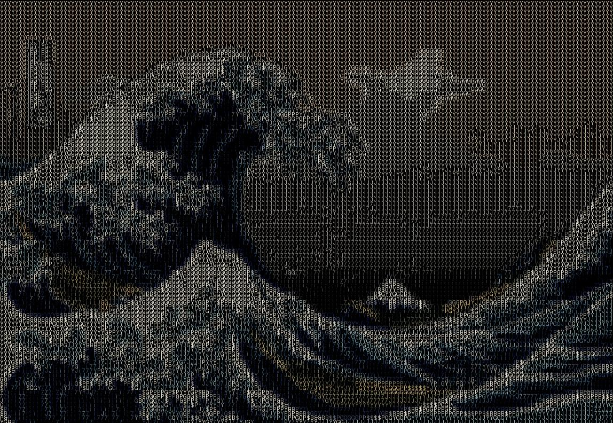

# ASCII Art Image Converter

This Python script converts images into ASCII art, generating both a visual `.jpg` version and a plain `.txt` file.
It supports multiple visual modes (`dark`, `bright`, `blur`), edge detection, and customizable character colors.

## Features

- Convert any image into ASCII art
- Output to both image (`.jpg`) and text (`.txt`)
- Visual modes:
  - `dark`: black background
  - `bright`: white background
  - `blur`: blurred image as background
- Optional edge detection using Sobel filters
- Color modes:
  - `image`: use the original pixel color
  - `fixed`: use a user-defined RGB color
- Fully configurable character sets and scaling

## Folder Structure

```
Ascii/
├── Aphelion/
│   ├── skull.jpg
│   ├── skull_ascii.jpg
│   ├── skull_ascii.txt
│   ├── wave.jpg
│   ├── wave_ascii.jpg
│   └── wave_ascii.txt
├── Ascii_converter.py
├── LICENSE.txt
├── README.md
└── requirements.txt
```

## Example Outputs

### Skull

**Original**


**ASCII Image**


**ASCII Text**
```
(see Aphelion/skull_ascii.txt)
```

### Wave

**Original**


**ASCII Image**


**ASCII Text**
```
(see Aphelion/wave_ascii.txt)
```

## Configuration

You can change settings at the top of the `Ascii_converter.py` file in the `CONFIG` dictionary:

```python
CONFIG = {
    "input_path": "Aphelion/skull.jpg",
    "output_image_path": "Aphelion/skull_ascii.jpg",
    "output_text_path": "Aphelion/skull_ascii.txt",
    "ascii_chars": " ;i7JYGP$B&#@",
    "scale_factor": 0.9,
    "font_size": None,
    "mode": "dark",              # Options: "dark", "bright", "blur"
    "use_edges": True,
    "char_color_mode": "fixed",  # Options: "image", "fixed"
    "char_fixed_color": (255, 255, 255)
}
```

## Usage

Install the required dependencies and run the script:

```
pip install -r requirements.txt
python Ascii_converter.py
```

## License

This project is licensed under the MIT License. See `LICENSE.txt` for details.
